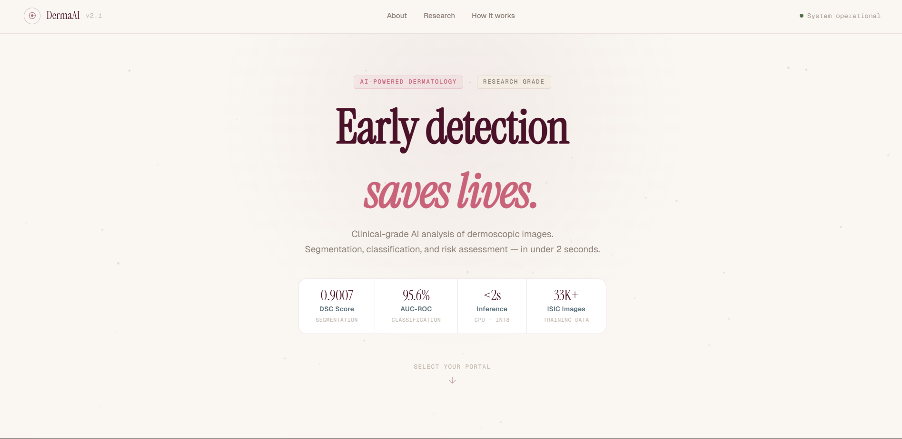
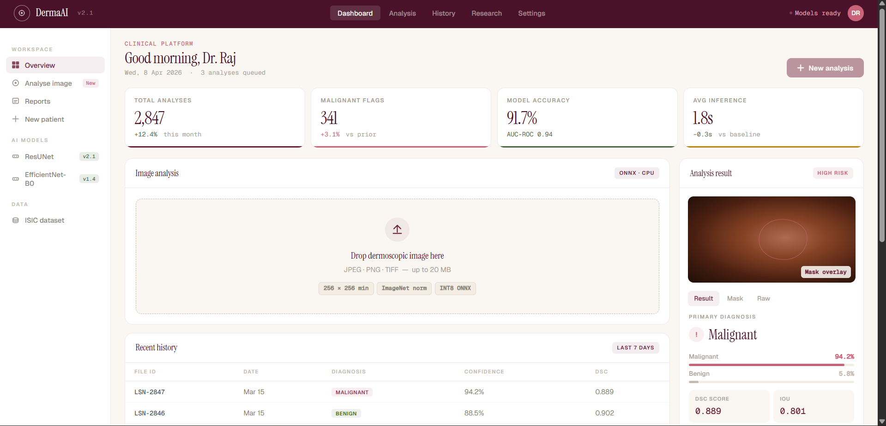
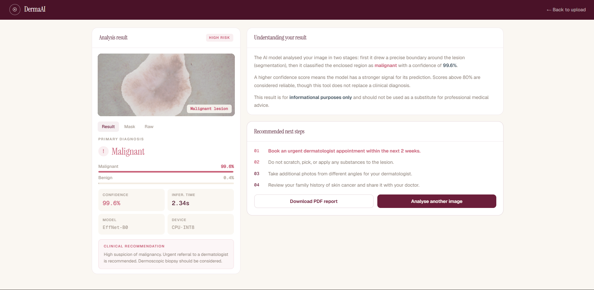

# DermaAI 

### AI-Powered Skin Lesion Detection & Classification System

---


<!--  -->


## Overview

DermaAI is a deep learning-based web application that performs automated skin lesion **segmentation** and **classification** using dermoscopic images.

The system helps in early detection of melanoma by providing:

* Fast predictions
* Lightweight deployment
* Clinically meaningful insights

Users can upload an image and receive:

* Segmentation mask
* Classification (Benign / Malignant)
* Confidence score
* Clinical recommendation

---

## Features

* 🧠 Two-stage AI pipeline (Segmentation + Classification)
* 🖼️ Lesion segmentation using U-Net / ResUNet
* 🔍 Classification using EfficientNet-B0 / ResNet-18
* ⚡ Fast inference (< 3 seconds on CPU)
* 🌐 Full-stack web app (React + FastAPI)
* 📊 Confidence score with probability visualization
* 🩺 Clinical recommendation system
* 📄 Downloadable report (PDF)

---

## Architecture

```
User Image → Preprocessing → Segmentation Model (U-Net)
           → Masked ROI → Classification Model → Prediction
           → Result Dashboard (Frontend)
```

---

## Tech Stack

**Frontend:**

* React.js
* Tailwind CSS

**Backend:**

* FastAPI

**Machine Learning:**

* PyTorch (Training)
* ONNX Runtime (Inference)

**Deployment:**

* Docker
* Nginx

**Dataset:**

* ISIC 2018 / 2019 / 2020

---

##  Model Details

| Component      | Model Used                      |
| -------------- | ------------------------------- |
| Segmentation   | ResUNet (U-Net + ResNet-18)     |
| Classification | EfficientNet-B0 / ResNet-18     |
| Loss Function  | Dice Loss + Focal Loss          |
| Optimization   | ONNX Export + INT8 Quantization |

---

## Performance Metrics

* Dice Score: **≥ 0.85**
* IoU: **≥ 0.78**
* AUC-ROC: **≥ 0.88**
* Inference Time: **< 3 seconds (CPU)**

---

## Project Structure

```
DermaAI/
├── frontend/          # React frontend
├── backend/           # FastAPI backend
├── models/            # Trained models (ONNX / PyTorch)
├── data/              # Dataset (not included in repo)
├── notebooks/         # Training & experimentation
├── requirements.txt
└── README.md
```

---

## ▶ How to Run

### 1. Clone the Repository

```bash
git clone https://github.com/your-username/DermaAI.git
cd DermaAI
```

### 2. Backend Setup

```bash
cd backend
pip install -r requirements.txt
uvicorn app:app --reload
```

### 3. Frontend Setup

```bash
cd frontend
npm install
npm start
```

---

## Use Cases

* 👨‍⚕️ Dermatologists – AI-assisted triage tool
* 🎓 Students – Learning medical AI systems
* 🔬 Researchers – Model experimentation & benchmarking

---

## Disclaimer

> This project is a **research prototype** and not a certified medical device.
> Predictions are advisory only and should not replace professional medical diagnosis.

---

## Future Improvements

* Multi-class classification (beyond benign/malignant)
* Transformer-based models (SegFormer, Swin-UNet)
* Mobile deployment (on-device inference)
* Real-time camera input
* Clinical compliance (HIPAA/DISHA)

---

## Credits

* ISIC (International Skin Imaging Collaboration) Dataset
* PyTorch
* FastAPI
* ONNX Runtime

---

## ⭐ Support

If you like this project, consider giving it a ⭐ on GitHub!
